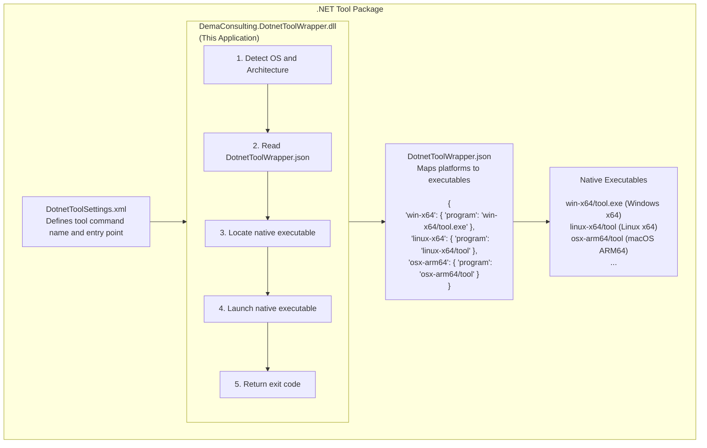

# Architecture

This document describes the architecture and design of the DotnetToolWrapper project.

## Overview

DotnetToolWrapper is a .NET console application that serves as a universal launcher for native applications packaged
as [.NET Tools][dotnet-tools]. It enables developers to distribute
platform-specific native executables through the .NET tool ecosystem.

## Problem Statement

The .NET tool ecosystem provides a convenient way to distribute and install command-line tools globally or locally
within projects. However, .NET tools are inherently limited to .NET applications. Many useful command-line tools are
written in other languages (C, C++, Rust, Go, etc.) and compiled to native executables. DotnetToolWrapper bridges this
gap by providing a managed .NET entry point that launches the appropriate native executable for the current platform.

## High-Level Architecture



## Core Components

### Program.cs

The main application logic consists of several key functions:

#### Platform Detection

- **`GetOs()`**: Detects the operating system (Windows, Linux, FreeBSD, macOS)
- **`GetArchitecture()`**: Detects the CPU architecture (x86, x64, ARM, ARM64, WASM, S390x)
- **`GetTarget()`**: Combines OS and architecture into a target string (e.g., "win-x64", "linux-arm64")

#### Configuration Management

The application reads `DotnetToolWrapper.json` to determine which native executable to launch for the detected platform.
This JSON file is located in the same directory as the wrapper DLL.

#### Process Execution

The wrapper locates the native executable, constructs a process with the original command-line arguments, and executes
it in the current working directory. The wrapper then waits for the process to complete and returns its exit code.

## Configuration Schema

### DotnetToolWrapper.json

The configuration file uses a simple JSON structure:

```json
{
  "<target-string>": {
    "program": "<path-to-executable>"
  }
}
```

- **Target String**: Combination of OS and architecture (e.g., "win-x64", "linux-arm64")
- **Program Path**: Relative or absolute path to the native executable
  - Relative paths are resolved from the wrapper's installation directory
  - Environment variables are expanded

### Supported Target Strings

| OS      | Architectures                                    | Notes                           |
|---------|--------------------------------------------------|---------------------------------|
| win     | x86, x64, arm, arm64                             | Windows platforms               |
| linux   | x86, x64, arm, arm64, s390x                      | Linux distributions             |
| freebsd | x86, x64, arm, arm64                             | FreeBSD platforms               |
| osx     | x64, arm64                                       | macOS platforms                 |
| browser | wasm                                             | WebAssembly (experimental)      |

## Design Decisions

### Multi-Framework Targeting

The application targets .NET 8.0, 9.0, and 10.0 to ensure broad compatibility across different .NET installations.
This allows the tool to work with both current and recent .NET SDK versions.

### Minimal Dependencies

The application has no external dependencies beyond the .NET standard library. This keeps the package size small and
reduces potential compatibility issues.

### Process Execution Model

The wrapper uses `ProcessStartInfo` with `UseShellExecute = false` to directly execute the native program without
involving the system shell. This provides better security and more predictable behavior across platforms.

### Exit Code Propagation

The wrapper exits with the same exit code as the wrapped native executable, ensuring that build scripts and automation
tools can correctly detect success or failure.

### Working Directory Preservation

The wrapper executes the native program in the user's current working directory, not in the installation directory.
This ensures that relative file paths in command-line arguments work as expected.

## Extension Points

### Environment Variables

The `program` path in the configuration supports environment variable expansion using standard .NET
`Environment.ExpandEnvironmentVariables()`. This allows for dynamic configuration based on the runtime environment.

### Future Enhancements

Potential future extensions could include:

- Custom environment variable injection
- Pre-launch and post-launch hooks
- Configuration-based argument transformation
- Logging and diagnostics options

## Security Considerations

- The wrapper does not validate or sanitize command-line arguments; they are passed directly to the native executable
- The configuration file must be trusted, as it specifies which executables to run
- The wrapper should be distributed with native executables from trusted sources
- Package creators should scan native executables for malware before distribution

## Performance Characteristics

- **Startup Overhead**: Minimal (< 50ms on modern hardware)
- **Memory Footprint**: Small (~20-30 MB for the .NET runtime + wrapper)
- **CPU Usage**: Negligible (the wrapper is idle while the native process runs)

## Testing Strategy

The project does not currently include automated tests. Testing is performed through:

1. Manual testing on target platforms (Windows, Linux, macOS)
2. Integration testing with sample .NET tool packages
3. CI/CD builds that verify compilation for all target frameworks

## Build and Release Process

The project uses GitHub Actions for CI/CD:

1. **Build Workflow**: Compiles the application for all target frameworks
2. **SBOM Generation**: Creates Software Bill of Materials for transparency
3. **Artifact Publishing**: Publishes build artifacts for packaging
4. **Release Workflow**: Creates releases with versioned artifacts

## Related Documentation

- [README.md](README.md) - Usage instructions and examples
- [CONTRIBUTING.md](CONTRIBUTING.md) - Contribution guidelines
- [SECURITY.md](SECURITY.md) - Security policy

[dotnet-tools]: https://learn.microsoft.com/en-us/dotnet/core/tools/global-tools
